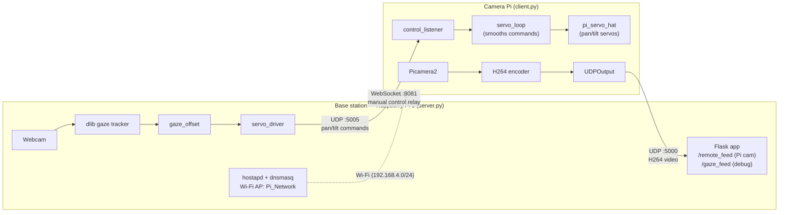

# Gaze-Controlled Pan/Tilt Camera

A remote camera rig you steer with your eyes. A webcam on the base station (a
Raspberry Pi 5) tracks your gaze; the offset from center is streamed to a
second Raspberry Pi carrying the camera, which drives a pan/tilt servo mount
toward wherever you're looking. The camera Pi's video feed is streamed back
and shown live alongside a debug view of your eye tracking. The Pi 5 also
hosts its own Wi-Fi access point so the camera Pi has a network to join
without depending on any external router.

## Why this matters

Eye movement is one of the fastest, most involuntary signals the human body
produces — you look at something before you reach for it, click on it, or
speak about it. That makes gaze a fast and low-effort control
channel, but it's almost entirely locked behind expensive, specialized
hardware today: commercial eye trackers (Tobii and similar systems) commonly
cost anywhere from several hundred to several thousand dollars, which puts
gaze-based control out of reach for most individuals, schools, and
independent researchers.

This project is a small-scale demonstration that a webcam and two Raspberry can
reproduce the core loop of a gaze-controlled system: detect where someone is 
looking, and move a physical device there in real time. It's not a substitute
for a clinical-grade eye tracker, but it shows that the underlying idea
doesn't require one. That has real implications:

- **Accessibility.** People with limited hand or arm mobility (e.g. ALS,
  spinal cord injuries, muscular dystrophy) are a primary use case for
  commercial eye-tracking systems — for controlling a computer, a
  communication device, or a powered wheelchair camera. Showing that a
  low-cost, open version of the underlying pipeline works is a step toward
  making that kind of control cheaper and more accessible.
- **Robotics & HCI.** Gaze is a natural fit for hands-free teleoperation —
  aiming a camera, a telepresence robot, or a drone gimbal just by looking,
  freeing the hands for other controls entirely.
- **Education & research.** Because it's built entirely from open-source
  tools (`dlib`, `OpenCV`) and commodity hardware, the whole pipeline is
  something a student or hobbyist can inspect, modify, and build on, instead
  of a closed commercial black box.

The specific rig — a pan/tilt camera — is just the clearest, most visible way
to prove the concept works end to end. The broader point is that gaze-based
control doesn't have to be expensive or exotic to be functional, and that's
what this project sets out to show.

## How it works



- **`server.py`** (run on the base station — a Raspberry Pi 5):
  - Captures the local webcam, finds your face and eyes with `dlib`, and estimates
    a rough gaze direction by locating the darkest point (pupil) within each eye's
    bounding box.
  - Smooths the gaze signal over a short rolling window and converts it into a
    horizontal/vertical offset from center (`-0.5` to `+0.5`).
  - A servo driver thread reads that offset at a fixed tick rate and sends
    `"pan,tilt"` angle commands to the Pi over UDP, proportionally to how far
    off-center your gaze is (with a small deadzone near center so you don't get
    jitter when looking roughly straight ahead).
  - Receives the camera Pi's H264 video stream over UDP, decodes it with PyAV, and
    serves both the remote camera feed and the gaze-tracking debug feed as MJPEG
    streams over a small Flask web UI.
  - Also runs a WebSocket server for relaying ad-hoc manual control commands to
    the Pi.
  - Hosts its own Wi-Fi access point (via `hostapd` + `dnsmasq`) so the camera
    Pi has a network to connect to directly — see [Wi-Fi access point setup](#wi-fi-access-point-setup-on-the-pi-5)
    below.

- **`client.py`** (run on the Raspberry Pi attached to the servo rig):
  - Connects to the base station's Wi-Fi access point.
  - Listens for `"x,y"` velocity commands over UDP and smooths them before
    applying, so the pan/tilt motion is fluid rather than jumpy.
  - Integrates that smoothed velocity into absolute pan/tilt angles, clamps them
    to `0–180°`, and drives the servos via `pi_servo_hat`.
  - Captures video with `Picamera2`, encodes it as H264, and streams it back to
    the base station over UDP in small chunks.

## Hardware

- **Base station:** Raspberry Pi 5 with a USB webcam (for gaze tracking) and
  a Wi-Fi adapter/interface capable of running an access point
- **Camera unit:** a second Raspberry Pi with a camera module
  (`Picamera2`-compatible) and a servo HAT (e.g. Adafruit/Waveshare pan-tilt
  HAT compatible with `pi_servo_hat`)
- Two servos (pan + tilt) mounted on a pan/tilt bracket with the camera Pi
- Both devices connected over the Pi 5's Wi-Fi access point (see below)

## Wi-Fi access point setup (on the Pi 5)

The base station Pi 5 broadcasts its own SSID so the camera Pi can connect
directly to it, without needing an external router.

1. Configure `hostapd`:
   ```
   sudo nano /etc/hostapd/hostapd.conf
   ```
   ```
   interface=wlan0_ap
   driver=nl80211
   ssid=Pi_Network
   hw_mode=g
   channel=1

   ieee80211n=0
   wmm_enabled=0
   ap_max_inactivity=0
   skip_inactivity_poll=1

   auth_algs=1
   wpa=2
   wpa_passphrase=raspberry123
   wpa_key_mgmt=WPA-PSK
   rsn_pairwise=CCMP
   ```

2. Start/restart the AP:
   ```
   sudo systemctl restart hostapd
   ```

3. Verify it's actually running as an AP:
   ```
   iw dev
   ```
   You should see:
   ```
   Interface wlan0_ap
       ssid Pi_Network
       type AP
   ```

4. Give the AP interface its local address:
   ```
   sudo ip addr flush dev wlan0_ap
   sudo ip addr add 192.168.4.1/24 dev wlan0_ap
   ```

5. Configure DHCP in `/etc/dnsmasq.conf`:
   ```
   interface=wlan0_ap
   dhcp-range=192.168.4.10,192.168.4.50,255.255.255.0,24h
   domain-needed
   bogus-priv
   ```

6. Restart DHCP:
   ```
   sudo systemctl restart dnsmasq
   ```

Once this is up, the camera Pi joins `Pi_Network` and gets an address in
`192.168.4.10–192.168.4.50`; the base station itself is `192.168.4.1`, which
is the `SERVER_IP` the camera Pi's `client.py` should point at, and `CLIENT_IP`
in `server.py` should match whatever address the camera Pi is assigned.

## Requirements

**Base station — Raspberry Pi 5 (`server.py`):**
```
pip install opencv-python numpy flask websockets av dlib
```
You'll also need the dlib 68-point face landmark model:
```
wget http://dlib.net/files/shape_predictor_68_face_landmarks.dat.bz2
bunzip2 shape_predictor_68_face_landmarks.dat.bz2
```
Place `shape_predictor_68_face_landmarks.dat` next to `server.py` (or update
`PREDICTOR_PATH`).

**Camera Pi (`client.py`):**
```
pip install pi-servo-hat picamera2
```
(`picamera2` is typically preinstalled on Raspberry Pi OS.)

## Configuration

Edit the constants at the top of each file to match your network:

| File | Variable | Meaning |
|---|---|---|
| `server.py` | `CLIENT_IP` | IP address the camera Pi is assigned on `Pi_Network` (e.g. `192.168.4.1x`) |
| `server.py` | `VIDEO_PORT` | UDP port the server listens on for the camera Pi's video stream |
| `server.py` | `CONTROL_PORT` | UDP port used to send pan/tilt commands to the camera Pi |
| `server.py` | `SMOOTH_LEN` | Number of frames to average for gaze smoothing |
| `server.py` | `TICK_S` | Servo command update interval (seconds) |
| `server.py` | `MAX_STEP` | Max degrees of movement per tick at full gaze deflection |
| `server.py` | `DEADZONE` | Gaze offset (0.0–0.5) treated as "looking at center" |
| `client.py` | `SERVER_IP` | IP address of the base station on `Pi_Network` (`192.168.4.1`) |
| `client.py` | `VIDEO_PORT` / `CONTROL_PORT` | Must match the server's values |
| `client.py` | `CHUNK_SIZE` | UDP payload chunk size for video packets |

Both `VIDEO_PORT` and `CONTROL_PORT` must match between the two files.

## Running it

1. On the base station Pi 5, make sure the access point is up (`hostapd` and
   `dnsmasq` running — see [Wi-Fi access point setup](#wi-fi-access-point-setup-on-the-pi-5)).
2. On the camera Pi, connect to `Pi_Network`, then run:
   ```
   python3 client.py
   ```
3. On the base station:
   ```
   python3 server.py
   ```
4. Open `http://192.168.4.1:8080/` in a browser to see the camera Pi's feed
   and the gaze-tracking debug view side by side.
5. Look around — the camera should follow your gaze after a short delay, with
   a small deadzone near the center of your field of view.

## Notes / limitations

- `wpa_passphrase=raspberry123` in the `hostapd.conf` above is a placeholder —
  change it before using this outside a controlled test setup.
- The gaze estimation is a simple "darkest point in the eye region" heuristic,
  not a calibrated eye-tracking model — accuracy depends heavily on lighting
  and webcam angle.
- There's no encryption or authentication on the UDP video/control channels or
  the WebSocket relay beyond the Wi-Fi AP's WPA2 password
- If no face is detected, the gaze offset resets to center and the rig stops
  moving until a face is found again.
