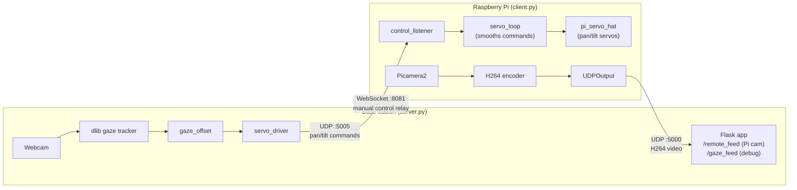

# Gaze-Controlled Pan/Tilt Camera
 
A remote camera rig you steer with your eyes. A webcam on the base station tracks
your gaze; the offset from center is streamed to a Raspberry Pi, which drives a
pan/tilt servo mount toward wherever you're looking. The Pi's camera feed is
streamed back and shown live alongside a debug view of your eye tracking.
 
## How it works
 

 
- **`server.py`** (run on the base station / powerful Raspberry Pi):
  - Captures the local webcam, finds your face and eyes with `dlib`, and estimates
    a rough gaze direction by locating the darkest point (pupil) within each eye's
    bounding box.
  - Smooths the gaze signal over a short rolling window and converts it into a
    horizontal/vertical offset from center (`-0.5` to `+0.5`).
  - A servo driver thread reads that offset at a fixed tick rate and sends
    `"pan,tilt"` angle commands to the Pi over UDP, proportionally to how far
    off-center your gaze is (with a small deadzone near center so you don't get
    jitter when looking roughly straight ahead).
  - Receives the Pi's H264 video stream over UDP, decodes it with PyAV, and serves
    both the remote camera feed and the gaze-tracking debug feed as MJPEG streams
    over a small Flask web UI.
  - Also runs a WebSocket server for relaying ad-hoc manual control commands to
    the Pi.
- **`client.py`** (run on the Raspberry Pi attached to the servo rig):
  - Listens for `"x,y"` velocity commands over UDP and smooths them before
    applying, so the pan/tilt motion is fluid rather than jumpy.
  - Integrates that smoothed velocity into absolute pan/tilt angles, clamps them
    to `0–180°`, and drives the servos via `pi_servo_hat`.
  - Captures video with `Picamera2`, encodes it as H264, and streams it back to
    the base station over UDP in small chunks.
## Hardware
 
- A Raspberry Pi with a camera module (`Picamera2`-compatible) and a servo HAT
  (e.g. Adafruit/Waveshare pan-tilt HAT compatible with `pi_servo_hat`)
- Two servos (pan + tilt) mounted on a pan/tilt bracket with the Pi camera
- A base station with a webcam (for gaze tracking) and a Flask-capable Python
  environment
- Both devices on the same local network
## Requirements
 
**Base station (`server.py`):**
```
pip install opencv-python numpy flask websockets av dlib
```
You'll also need the dlib 68-point face landmark model:
```
wget http://dlib.net/files/shape_predictor_68_face_landmarks.dat.bz2
bunzip2 shape_predictor_68_face_landmarks.dat.bz2
```
Place `shape_predictor_68_face_landmarks.dat` next to `server.py` (or update
`PREDICTOR_PATH`).
 
**Raspberry Pi (`client.py`):**
```
pip install pi-servo-hat picamera2
```
(`picamera2` is typically preinstalled on Raspberry Pi OS.)
 
## Configuration
 
Edit the constants at the top of each file to match your network:
 
| File | Variable | Meaning |
|---|---|---|
| `server.py` | `CLIENT_IP` | IP address of the Raspberry Pi |
| `server.py` | `VIDEO_PORT` | UDP port the server listens on for the Pi's video stream |
| `server.py` | `CONTROL_PORT` | UDP port used to send pan/tilt commands to the Pi |
| `server.py` | `SMOOTH_LEN` | Number of frames to average for gaze smoothing |
| `server.py` | `TICK_S` | Servo command update interval (seconds) |
| `server.py` | `MAX_STEP` | Max degrees of movement per tick at full gaze deflection |
| `server.py` | `DEADZONE` | Gaze offset (0.0–0.5) treated as "looking at center" |
| `client.py` | `SERVER_IP` | IP address of the base station |
| `client.py` | `VIDEO_PORT` / `CONTROL_PORT` | Must match the server's values |
| `client.py` | `CHUNK_SIZE` | UDP payload chunk size for video packets |
 
Both `VIDEO_PORT` and `CONTROL_PORT` must match between the two files.
 
## Running it
 
1. On the Raspberry Pi:
```
   python3 client.py
```
2. On the base station:
```
   python3 server.py
```
3. Open `http://<base-station-ip>:8080/` in a browser to see the Pi's camera
   feed and the gaze-tracking debug view side by side.
4. Look around — the camera should follow your gaze after a short delay, with
   a small deadzone near the center of your field of view.
## Notes / limitations
 
- The gaze estimation is a simple "darkest point in the eye region" heuristic,
  not a calibrated eye-tracking model — accuracy depends heavily on lighting
  and webcam angle.
- There's no encryption or authentication on the UDP video/control channels or
  the WebSocket relay; this is intended for a trusted local network, not the
  open internet.
- If no face is detected, the gaze offset resets to center and the rig stops
  moving until a face is found again.
